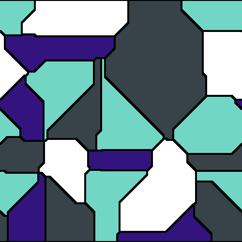
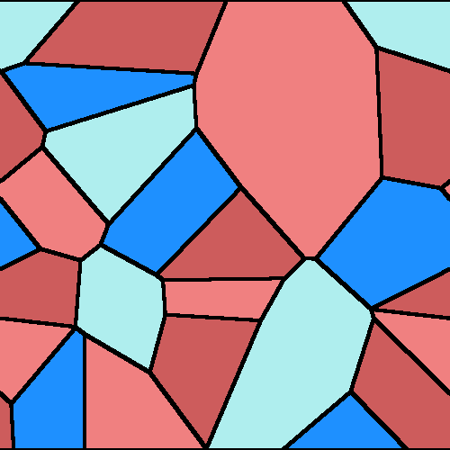

<h1 align="center">
    Voronoi Generator: A tool for creating Voronoi Diagrams
</h1>

A tool for generating Voronoi diagrams.

## Creating diagram from a config file

Voronoi diagrams can be created from yaml config files by passing the config file as an argument to `main.py` in the `voronoi_generator` directory, for instance

```bash
python main.py example_configs/demo_1.yaml
```

This generates a Voronoi diagram from the following config.

```yaml
x_size: 500
y_size: 500
n_centroids: 20
distance_function: "cityblock"
colour_list: [[113, 215, 196], [51, 20, 126], [255, 255, 255], [55, 66, 73]]
wrap_x: true
border_thickness: 4
file_path: "images/example_image.png"

numpy_seed: 1
python_seed: 1
```

This produces the following diagram:



## Named Colours

Rather than using RGB values, it is possible to pass a yaml file of named colours.
An example file is provided in the `colour_lists` directory. With such a file, we have
a config that looks like the following:

```yaml
x_size: 1000
y_size: 1000
n_centroids: 20
distance_function: "euclidean"
colour_list: ["dodgerblue", "indianred", "paleturquoise", "lightcoral"]
named_colours_file: "colour_lists/css_colour_list.yaml"
wrap_x: true
border_thickness: 4
file_path: "images/example_image_2.png"

numpy_seed: 1
python_seed: 1
```

This produces the following image:


