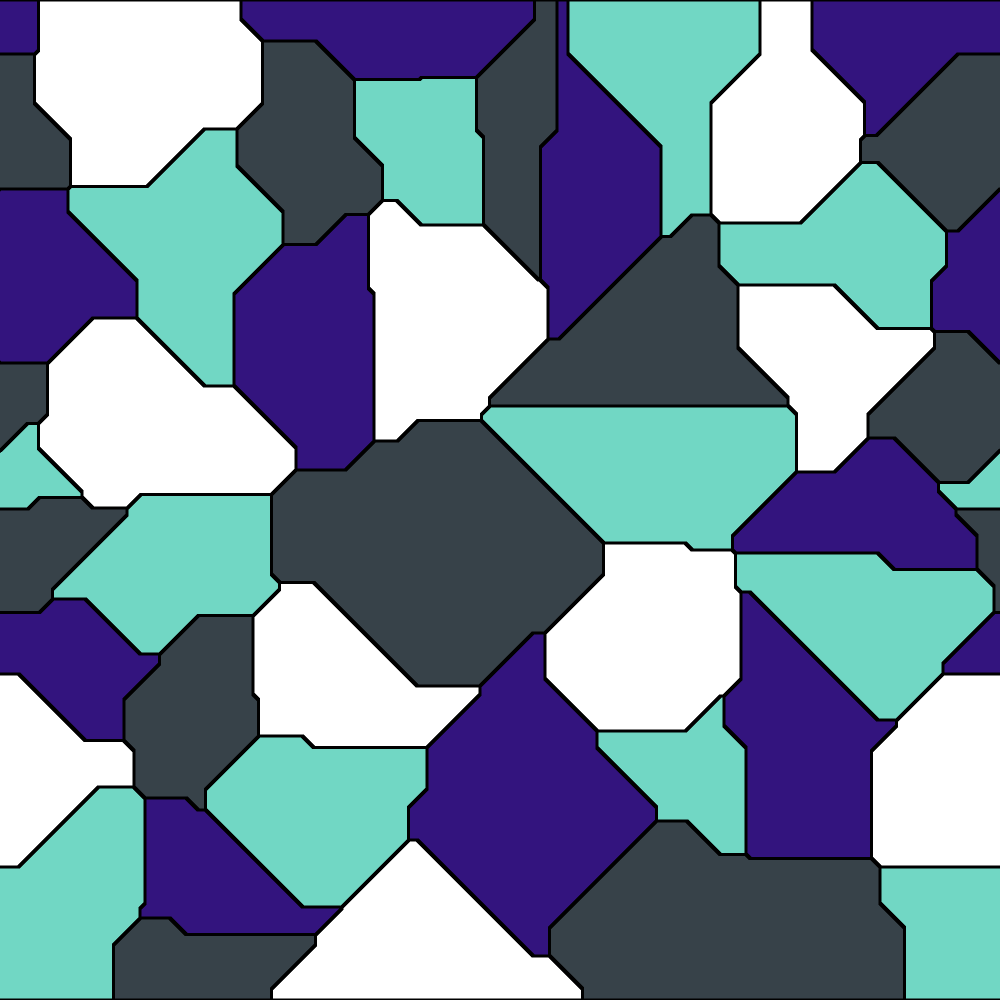
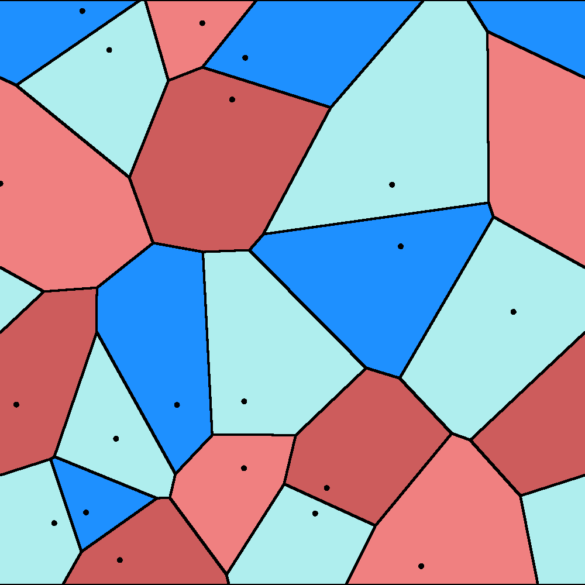

<h1 align="center">
    Voronoi Generator: A tool for creating Voronoi Diagrams
</h1>

This library allows for config-driven creation of Voronoi diagrams, implemented in fully-vectorised numpy.

**Features include**:

* Choice of distance functions (from scikit-learn's pairwise distances)
* Vertical/horizontal tiling of plane
* Fully customisable colour palette, using a four-colour solver to prevent adjacent regions from sharing a colour
* Optional region borders
* Manual centroid placement
* Centroid placement using uniform random placement, or poisson disk sampling with adjustable disk size
* Ability to draw centroids on image


Thanks to [Fuzzy Labs](https://fuzzylabs.ai) for their support in the  making of this library.

## Creating diagram from a config file

Voronoi diagrams can be created from yaml config files by passing the config file as an argument to `main.py` in the `voronoi_generator` directory, for instance

```bash
python voronoi_generator/main.py example_configs/demo_1.yaml
```

This generates a Voronoi diagram from the following config.

```yaml
x_size: 2000
y_size: 2000
n_centroids: 40
distance_function: "cityblock"
colour_list: [[113, 215, 196], [51, 20, 126], [255, 255, 255], [55, 66, 73]]
wrap_x: true
border_thickness: 6
file_path: "images/example_image.png"

numpy_seed: 0
python_seed: 0

```

This produces the following diagram:



## Named Colours

Rather than using RGB values, it is possible to pass a yaml file of named colours.
An example file is provided in the `colour_lists` directory. With such a file, we have
a config that looks like the following:

```yaml
x_size: 1000
y_size: 1000
n_centroids: 20
distance_function: "euclidean"
colour_list: ["dodgerblue", "indianred", "paleturquoise", "lightcoral"]
named_colours_file: "colour_lists/css_colour_list.yaml"
wrap_x: true
border_thickness: 4
file_path: "images/example_image_2.png"

numpy_seed: 1
python_seed: 1
```

This produces the following image:




## Sampling Methods

The default sampling method is to generate centroids using a uniform distribution over
the image. When using this method, you need to specify the number of points.

Alternatively, you can use Poisson disk sampling to generate points more evenly across
the pixel space. The following shows two similar configurations, one using the default
distribution, the other using poission disk sampling

**Uniform Distribution**
```yaml
x_size: 2000
y_size: 2000
n_centroids: 80
distance_function: "euclidean"

named_colours_file: "colour_lists/css_colour_list.yaml"
colour_list: ["lemonchiffon", "tomato", "skyblue", "steelblue"]
border_thickness: 5
centroid_thickness:  0
file_path: "images/demo_4_uniform.png"

numpy_seed: 0
python_seed: 0
```

**Poisson Disk sampling**
```yaml
x_size: 2000
y_size: 2000
distance_function: "euclidean"

named_colours_file: "colour_lists/css_colour_list.yaml"
colour_list: ["lemonchiffon", "tomato", "skyblue", "steelblue"]
border_thickness: 5
centroid_thickness:  0
file_path: "images/demo_4_poisson.png"

sampling_method: "poisson"
poisson_radius: 0.09

numpy_seed: 0
python_seed: 0
```
The resulting images are as follows:

<table>
    <tr>
    <td><b>Uniform Distribution</b></td>
    <td><b>Poisson Disk Sampling</b></td>
    </tr>
    <tr>
  <td></td>
  <td>  </td>
    </tr>
</table>

Note that in the latter case, the number of centroids is determined by the poisson radius. The variable `n_centroids` is still used, but only in that 10x its value is the upper limit on the number of points produced by sampling procedure.

# List of Settings

The full list of configurable settings in the yaml files is as follows:

```
    x_size (int): Width of the image in pixels
    y_size (int): Height of the image in pixels
    n_centroids (int): Number of centroids to include
    distance_function (str): Distance function to use ("euclidean", "cityblock" or "chebyshev")
    colour_list (list[Union[list[int], str]]): list of colour names or RGB values.
    named_colours_file (str) = Path to file defining named colours
    colouring (str): Whether to use solver for colouring ("solve" or "random")
    wrap_x (bool): Whether image should wrap on x-axis
    wrap_y (bool): Whether image should wrap on y-axis
    border_thickness (int): Thickness of the border between tiles in pixels
    centroid_thickness (int): Size of the centroid point in pixels
    centroid_colour (Union[list[int], str]): Colour of centroid points
    file_path (str): File path where the image should be saved
    numpy_seed (int): The random seed for numpy
    python_seed (int): The random seed for Python
    sampling_method (string): The sampling method (either "uniform" or "poisson"
    # Radius to use in Poisson sampling
    poisson_radius (float): Poisson disk radius, given as fraction of image width

    # May become deprecated
    placed_points (Optional[list[list[float]]]): coordinates of manually placed points
    point_radius (Optional[float]): How far from manually placed points randomly placed points must be
```
